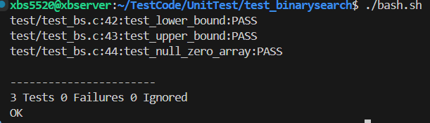

# Binary Search 

Simple binary search utility in C, providing lower_bound and upper_bound for sorted integer arrays.

## API

### Functions (`binarysearch.h`/`binarysearch.c`)
- `int lower_bound(const int* a, int n, int target)`
- `int upper_bound(const int* a, int n, int target)`

## Description
- `lower_bound` returns the index of the first element in the array that is **greater than or equal to** `target`.
- `upper_bound` returns the index of the first element in the array that is **greater than** `target`.
- If no such element exists, both functions return `n` (the array length).
- The input array must be sorted in **non-decreasing order**.

## Notes
- Time complexity: O(log n)
- Space complexity: O(1)
- Both functions use binary search and do not modify the input array.

## Unit Test

