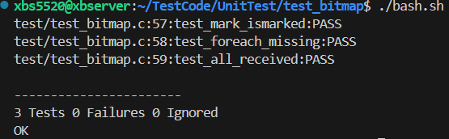

# Bitmap64 

Simple 64-bit bitmap utility in C, for marking and checking received indices, and iterating missing ones.

## API

### Functions (`bitmap64.h`/`bitmap64.c`)
- `void mark(bitmap64* bm, int i)`
- `int is_marked(bitmap64 bm, int i)`
- `void foreach_missing(bitmap64 bm, int total, missing_cb cb)`
- `int all_received(bitmap64 bm, int total)`

## Notes
- `mark` sets the i-th bit to 1 (received).
- `is_marked` returns 1 if the i-th bit is set, 0 otherwise.
- `foreach_missing` calls the callback for each index not marked (bit is 0).
- `all_received` returns 1 if all bits in [0, total) are set, 0 otherwise.
- The bitmap is a 64-bit unsigned integer, can track up to 64 items.
- The callback type for `foreach_missing` is `void (*missing_cb)(int idx)`.

## Unit Test result

