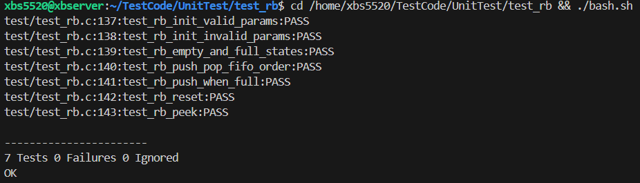

### Ring Buffer

Fixed-capacity circular queue using one-slot-empty policy (usable cap = N-1).

API
- init: rb_init(q, buf, cap); reset: rb_reset
- status: rb_empty/rb_full/rb_size/rb_free
- single-byte: rb_push/rb_pop/rb_peek
- bulk: rb_write/rb_read (best-effort)

Notes
- Capacity must be >=2; one slot unused to disambiguate full vs empty.
- For power-of-two capacities you can replace wrap with & (cap-1) if desired.
- Concurrency: this is SPSC; for ISR↔main-loop typical embedded use, declare indices volatile and ensure critical sections if needed.
- Tests: try empty→pop(0); fill→push(0); wrap by pushing >cap items with interleaved pops.

### UnitTest

`test_rb.c`

