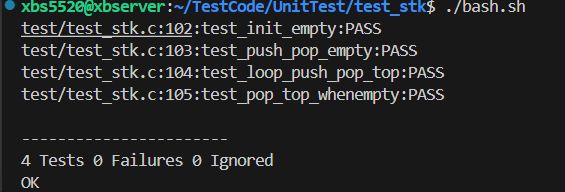

# Stack (C, Array & Linked List)

Simple stack implementation in C, supporting both array-based and linked-list-based versions.

## API

### Array Version (`stackarray.h`/`stackarray.c`)
- `stack_init(StackArray* s)`
- `stack_push(StackArray* s, int x)`
- `stack_pop(StackArray* s)`
- `stack_top(StackArray* s, int* ret)`
- `stack_empty(StackArray* s)`

### Linked List Version (`stacklist.h`/`stacklist.c`)
- `stacklist_init(StackList* s)`
- `stacklist_push(StackList* s, int x)`
- `stacklist_pop(StackList* s)`
- `stacklist_top(StackList* s, int* ret)`
- `stacklist_empty(StackList* s)`

## Notes
- Array stack has fixed capacity (`MAXN`), returns 0 on overflow/underflow.
- Linked list stack is dynamic, returns 0 on malloc failure or underflow.
- All `top` functions return 0 if stack is empty, and set the value via pointer.
- All `empty` functions return 1 if stack is empty, 0 otherwise.
- For array stack, `top` points to the next insert position.
- For linked list stack, `head` points to the top node.

## Unit Test result

